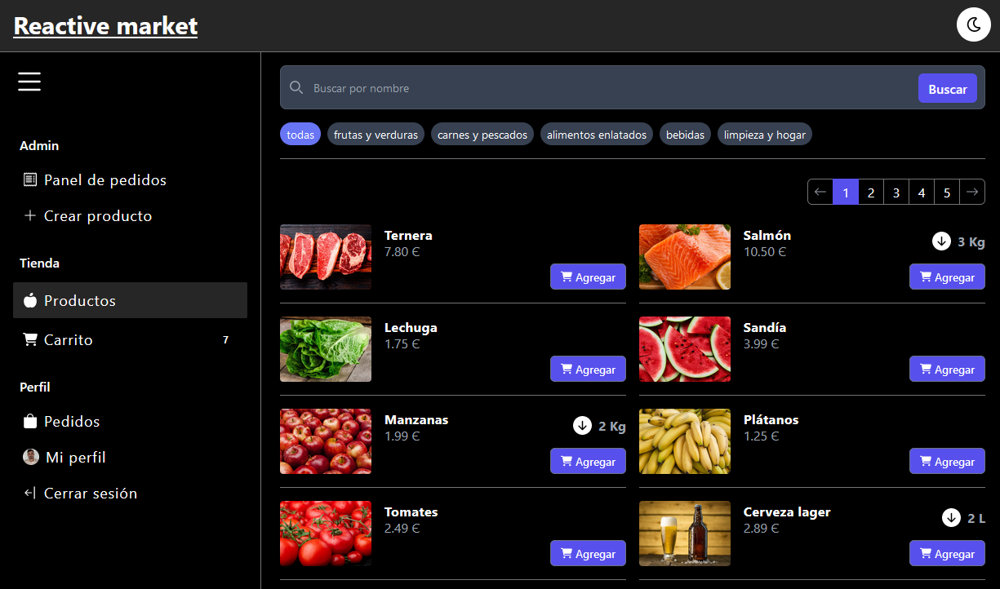
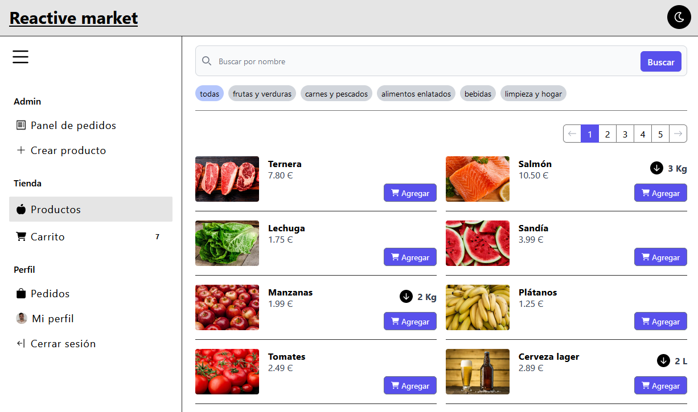

# Reactive market

This is the frontend side of an application that manage the orders of a delivery supermarket.

## Stack
* react
* react-router-dom
* redux
* tailwind
* it depends of two different backends, [market-api](https://github.com/Edkiri/market-api) and [express-s3-api](https://github.com/Edkiri/express-s3-api).

## Features

#### No users
* Products listing without authentication.
* Build a cart with products.
* Filter products by name and category.
* Products list pagination.
* Switch between dark and light mode

#### Users
* Sign up or login as user or admin.
* Update profile info and picture.
* Make an order.
* See orders status.
* Logout.

### Admin
* See all orders.
* Insert new products into the database.

## Preview

#### Dark Mode

#### Light Mode
